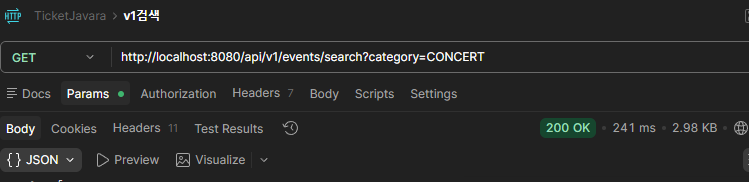
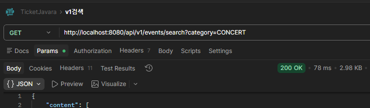
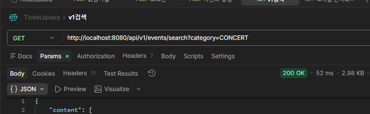
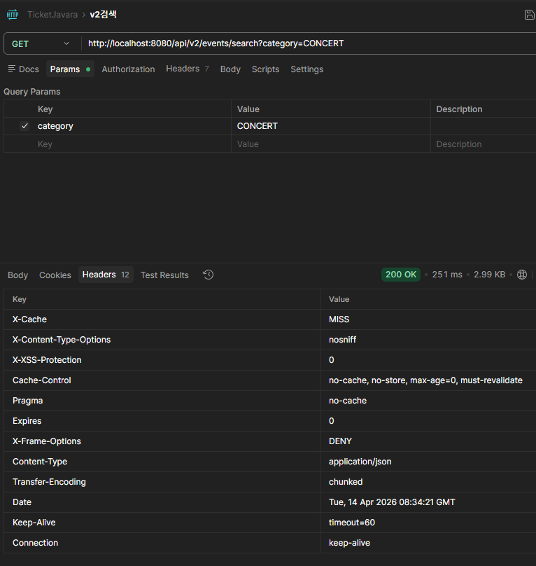
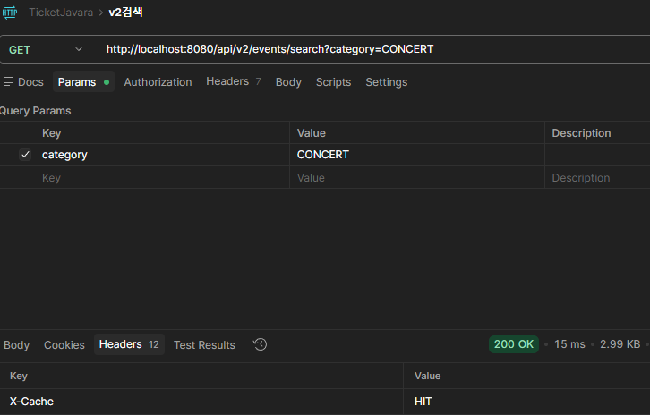
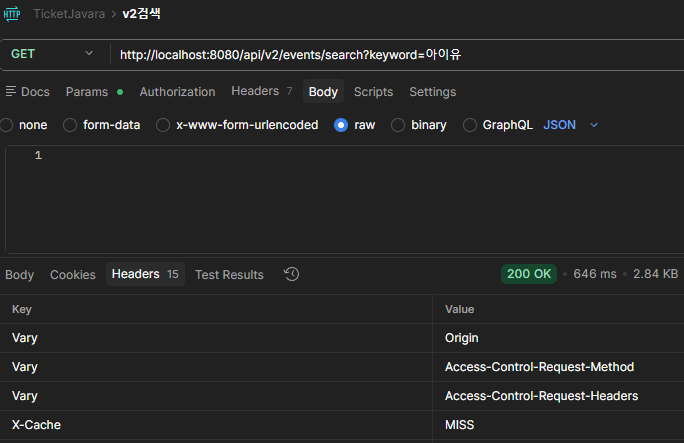
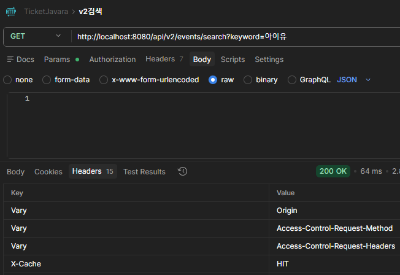

# 🎫 티켓을 JAVA라 — TicketFlow

> 스파르타 Spring 3기 | Team HOT6
> 공연·스포츠 티켓팅 플랫폼 백엔드

[](https://adoptium.net/)
[](https://spring.io/projects/spring-boot)
[](https://www.mysql.com/)
[](https://redis.io/)
[](https://www.docker.com/)
[](https://aws.amazon.com/)

---

## 📌 목차

1. [프로젝트 소개](#1-프로젝트-소개)
2. [팀원 소개](#2-팀원-소개)
3. [기술 스택](#3-기술-스택)
4. [시스템 아키텍처](#4-시스템-아키텍처)
5. [ERD](#5-erd)
6. [핵심 기능](#6-핵심-기능)
   - [이벤트 & 검색](#6-1-이벤트--검색)
   - [검색 캐싱 3단계 진화](#6-2-검색-캐싱-3단계-진화)
   - [인기 검색어](#6-3-인기-검색어-redis-zset)
   - [동시성 제어 - 좌석 예매](#6-4-동시성-제어--좌석-예매)
   - [실시간 채팅 CS](#6-5-실시간-채팅-cs)
7. [인프라 & 배포](#7-인프라--배포)
8. [트러블슈팅](#8-트러블슈팅)

---

## 1. 프로젝트 소개

### 배경

온라인 티켓팅 시장은 순간적으로 수천~수만 명이 동시에 접속하는 **극단적 트래픽 집중** 환경입니다.
인터파크, 멜론티켓, YES24 티켓 등 기존 서비스에서도 오픈 직후 서버 다운, 중복 예매, 재고 불일치 문제가 반복적으로 발생합니다.

### 목표

| 목표 | 해결 기술 |
|------|-----------|
| 동시 요청에서 데이터 정합성 보장 | Redis 분산락 (Lettuce SETNX) + ACTIVE_BOOKING PK 이중 방어 |
| 검색 성능 최적화 | Caffeine 로컬 캐시 → Redis Cache-Aside 3단계 진화 |
| 실제 운영 환경 배포 경험 | GitHub Actions + Docker + AWS EC2/RDS/ElastiCache |
| 실시간 CS 응대 | WebSocket + STOMP |

### 프로젝트 기간

```
2026.04.08 ~ 2026.04.28 (3주)
설계 3일 → 개발 2주 → QA/배포 1주
```

---

## 2. 팀원 소개

| 역할 | 이름 | 담당 도메인 |
|------|------|------------|
| 팀장 | 정태규 | 프로젝트 총괄, 인프라/배포 |
| 부팀장 | 이지민 | 좌석/예매 도메인, 결제 연동, 프론트엔드 |
| 팀원 | 선경안 | 이벤트 도메인, 검색/캐싱, 인기 검색어 |
| 팀원 | 강태훈 | 쿠폰 도메인, 채팅 도메인, QA |
| 팀원 | 임하은 | 인증/보안, 유저 도메인, 프론트엔드, 발표 |

---

## 3. 기술 스택

### Backend
| 분류 | 기술 |
|------|------|
| 언어 / 프레임워크 | Java 17, Spring Boot 3.x |
| ORM | Spring Data JPA, QueryDSL |
| 인증 | Spring Security, JWT |
| 로컬 캐시 | Caffeine |
| 분산 캐시 / 락 | Redis 7 (Lettuce SETNX) |
| 실시간 통신 | WebSocket + STOMP |
| 결제 연동 | Mock PG (Toss Payments 구조) |

### Database
| 분류 | 기술 |
|------|------|
| RDBMS | MySQL 8 |
| 캐시 스토어 | Redis 7 |

### Infra & DevOps
| 분류 | 기술 |
|------|------|
| 컨테이너 | Docker, Docker Compose |
| 클라우드 | AWS EC2, RDS, ElastiCache, ECR |
| CI/CD | GitHub Actions |
| 이미지 저장소 | Docker Hub |

### 협업 도구
| 분류 | 도구 |
|------|------|
| 프로젝트 관리 | Jira |
| 디자인 | Figma |
| 문서화 | Notion |
| AI 개발 도구 | Google Antigravity, KIRO |

---

## 4. 시스템 아키텍처

```
[Users / Clients]
        │ HTTPS
        ▼
[Application Load Balancer]
        │ HTTP :8080
        ▼
[EC2 t3.small — Spring Boot · Docker]
     │              │
     │ MySQL :3306  │ Redis :6379
     ▼              ▼
[RDS MySQL 8]   [ElastiCache Redis]
(Private Subnet) (Private Subnet)

[GitHub Actions]
  → Docker build
  → Docker Hub push
  → EC2 SSH 배포
  → 헬스체크 3단 방어 (60s 대기 / 5s × 30회 retry / 실패 시 자동 롤백)
```

### VPC 보안 구성

| 서브넷 | 배치 컴포넌트 | 인터넷 접근 |
|--------|-------------|------------|
| Public Subnet | ALB, EC2 | ✅ 허용 |
| Private Subnet | RDS, ElastiCache | ❌ 차단 |

---

## 5. ERD

```
공연장(VENUE) → 공연(EVENT) → 구역(SECTION) → 좌석(SEAT)
                    │
                    ▼
               예매(BOOKING) ──────────▶ 활성 예매(ACTIVE_BOOKING)
                    │                   (중복 확정 DB 레벨 차단)
                    ▼
사용자(USER) ──▶ 주문(ORDER) ──▶ 결제(PAYMENT)
      │               │
      ▼               ▼
 사용자쿠폰(USER_COUPON) ← 쿠폰(COUPON)
      │
      ▼
 채팅방(CHAT_ROOM) ──▶ 채팅메시지(CHAT_MESSAGE)
```

---

## 6. 핵심 기능

---

### 6-1. 이벤트 & 검색

#### 이벤트 상태 관리 — Soft Delete 설계

관리자가 이벤트를 삭제할 때 물리 삭제(DELETE) 대신 **Soft Delete** 방식으로 status를 전환합니다.

| 상태 | 전환 주체 | 이유 |
|------|-----------|------|
| `ON_SALE` | 관리자 등록 | 판매 중 |
| `SOLD_OUT` | 시스템 자동 | 잔여석 = 0 |
| `CANCELLED` | 관리자 수동 | 공연 취소 |
| `ENDED` | 스케줄러 자동 | 날짜 지남 |
| `DELETED` | 관리자 수동 | 노출 차단 |

**왜 Soft Delete를 선택했나?**

| 항목 | 물리 삭제 (DELETE) | Soft Delete ✅ 채택 |
|------|-------------------|---------------------|
| FK 정합성 | BOOKING.event_id 깨짐 | 유지 |
| 예매 이력 | 삭제로 조회 불가 | BOOKING 이력 보존 |
| 구현 복잡도 | 높음 (CASCADE 처리) | 낮음 (status 필터 추가) |
| 복구 가능성 | 불가 | 가능 (status 재변경) |

- **FK 보호**: 물리 삭제 시 BOOKING.event_id FK가 깨져 예매 이력 훼손 — 절대 불가
- **안전장치**: ACTIVE_BOOKING 존재 시 DELETED 전환 차단 (409) — 확정 예매 있으면 삭제 불가
- **조회 단순화**: `WHERE status != 'DELETED'` 한 줄 추가만으로 전체 조회에서 일괄 제외

---

### 6-2. 검색 캐싱 3단계 진화

검색 성능을 3단계로 개선하며 각 단계의 한계를 직접 경험하는 것이 핵심 학습 목표였습니다.

> **왜 3단계로 나눴나?**
> 각 단계의 한계를 직접 경험해야 다음 단계의 필요성이 생깁니다.
> 이 수치 없이는 다음 단계 효과를 증명할 수 없습니다.

---

#### v1 — 캐시 없음 (기준선 측정)

- 매 요청마다 MySQL Full Scan 발생
- 이벤트 약 5,000개 기준 응답이 눈에 띄게 느려짐
- **한계**: 매 요청마다 DB 조회 → 서버 부하 집중

**v1 첫 번째 검색 : 241ms**




**v1 두 번째 검색 : 78ms**



**v1 여러 번 검색 (평균 속도)**



> 💡 v1 첫 번째와 두 번째 검색 속도 차이가 나는 이유:
> JVM 웜업(JIT 컴파일러가 hot path 최적화 전)과 첫 호출 시 DB 조회 초기화 비용 때문입니다.
> 두 번째 호출부터는 커넥션 풀과 쿼리 캐시가 안정화되어 응답이 빨라집니다.

---

#### v2 — Caffeine 로컬 캐시 적용

- `@Cacheable` TTL 5분, maximumSize 1000, LRU 적용
- JVM 힙 캐시 → 응답 속도 대폭 단축
- **한계**: Scale-out 시 서버 간 캐시가 분리됨 → 서버 A 캐시 HIT, 서버 B 캐시 MISS → 불일치 발생

```java
// application.yml
cache:
provider: caffeine  # caffeine | redis (Feature Flag로 전환)
lock:
provider: lettuce   # lettuce | redisson (동일 패턴 — 팀 학습 일관성)
```

**v2 Caffeine 캐시 MISS (첫 번째 호출) : 251ms**



**v2 Caffeine 캐시 HIT (두 번째 이후) : 15ms**



> 💡 v2 첫 호출이 v1보다 살짝 느린 이유:
> 1. JVM 웜업 — JIT 컴파일러 최적화 전
> 2. 캐시 저장 오버헤드 — 첫 호출은 DB 조회 + 캐시 PUT이 동시에 일어남
>
> 두 번째 호출부터는 캐시 HIT로 응답 속도가 안정적으로 단축됩니다.

---

#### v2+ — Redis Cache-Aside 분산 캐시 전환

- 전체 서버 캐시 공유 → Scale-out 환경에서 일관성 보장
- **한계**: Redis 왕복 1~2ms 추가 네트워크 비용 발생

**v2 Redis 캐시 MISS : 646ms**



**v2 Redis 캐시 HIT : 64ms**



---

#### 3단계 성능 비교 요약

| 단계 | 방식 | 캐시 HIT 응답 | 한계 |
|------|------|--------------|------|
| v1 | 캐시 없음 | ~52ms (평균) | 매 요청 DB Full Scan |
| v2 Caffeine | 로컬 캐시 | ~8ms | Scale-out 시 캐시 불일치 |
| v2+ Redis | 분산 캐시 | ~64ms (네트워크 포함) | Redis 왕복 비용 발생 |

> Redis 캐시 HIT가 Caffeine보다 느린 이유:
> Caffeine은 JVM 힙 내부 접근이지만, Redis는 네트워크 왕복(1~2ms)이 포함됩니다.
> Scale-out 환경에서는 Redis의 일관성 보장이 이 차이를 상쇄합니다.

---

#### Feature Flag — yml 한 줄로 전환

**왜 Feature Flag로 설계했나?**

| 구분 | 코드 직접 교체 | Feature Flag ✅ |
|------|---------------|----------------|
| 전환 방법 | Git 되돌리기 + 코드 수정 + 재배포 | yml 값 1개 변경 → 재배포만으로 즉시 전환 |
| 롤백 | 운영 중 위험 발생 | Redis 장애 시 caffeine으로 한 줄 롤백 |
| 코드 수정 | 필요 | Zero |

```yaml
# application.yml — 이 한 줄만 바꾸면 캐시 구현체가 자동 전환됩니다
cache:
   provider: caffeine  # → redis 로 변경만으로 전환

lock:
   provider: lettuce   # → redisson 으로 변경만으로 전환 (동일 패턴)
```

`@ConditionalOnProperty`가 `CacheManager` Bean을 자동 전환하므로 코드 수정 없이 운영 중 안전하게 전환·롤백이 가능합니다.

---

#### 검색 API 구현 — QueryDSL 동적 쿼리

**왜 QueryDSL을 선택했나?**

| 항목 | JPA @Query | QueryDSL ✅ |
|------|-----------|------------|
| 동적 쿼리 | 조건별 메서드 분리 필요 | BooleanBuilder로 조건 조합 |
| 타입 안정성 | 문자열 기반 JPQL | 컴파일 타임 검증 |
| 유지보수 | 조건 추가 시 메서드 추가 | 조건 블록만 추가 |

```java
// BooleanBuilder 동적 검색 구현 예시
BooleanBuilder builder = new BooleanBuilder();
if (keyword != null) builder.and(event.title.contains(keyword));
        if (category != null) builder.and(event.category.eq(category));
        if (minPrice != null) builder.and(/* EXISTS 서브쿼리 */);
```

단순 조회는 JPA로, 검색처럼 조건 조합이 많은 부분은 QueryDSL로 분리했습니다.

---

### 6-3. 인기 검색어 (Redis ZSet)

Redis의 **Sorted Set(ZSet)** 을 활용해 검색어별 점수를 관리하고 상위 N개를 효율적으로 조회합니다.

```
검색 발생 시 → ZINCRBY popular:keywords 1 "{keyword}"
인기 검색어 조회 → ZREVRANGE popular:keywords 0 9 WITHSCORES (Top 10)
```

| 고려 사항 | 구현 방식 |
|-----------|-----------|
| 집계 기간 | 실시간 (TTL 기반 키 분리) |
| 중복 카운팅 방지 | 1시간 1회 Redis 중복 방지 |
| 조회 성능 | O(log N + M) — ZSet 특성상 빠른 랭킹 조회 |

---

### 6-4. 동시성 제어 — 좌석 예매

티켓팅에서 가장 중요한 기능입니다. 인기 공연 오픈 시 수천 명이 동일 좌석에 동시 접근하는 상황을 안전하게 처리합니다.

#### 왜 분산락(Lettuce SETNX)을 선택했나?

| 구분 | 낙관적 락 | 비관적 락 | 분산 락 ✅ |
|------|----------|----------|-----------|
| 관리 주체 | JPA @Version | DB (InnoDB) | Redis |
| 보호 범위 | DB 수정 시점 | DB 트랜잭션 | 비즈니스 로직 전체 |
| Scale-out | 불가 | 불가 | 가능 |
| 실패 전략 | 재시도 폭발 | 대기 → 병목 | Fail Fast ✅ |

**티켓팅 = 충돌 많음 + Fail Fast 필요 → Lettuce SETNX가 최적**

#### Lettuce vs Redisson vs ZooKeeper

| 항목 | Lettuce SETNX ✅ | Redisson RLock | ZooKeeper |
|------|----------------|---------------|-----------|
| 단순성 | 높음 | 중간 | 낮음 |
| 추가 인프라 | 없음 (Redis만) | 없음 | 필요 |
| 구현 부담 | 직접 구현 필요 | API 제공 | 구축 복잡 |
| 프로젝트 적합도 | ✅ | 오버스펙 | 오버스펙 |

#### Lettuce SETNX 구조화 3요소

**① Lua Script 원자화**

GET → DEL 사이에 다른 스레드가 끼어드는 것을 원천 차단.
UUID 검증 + DEL을 한 번의 스크립트로 처리해 "내 락만 해제"를 보장합니다.

**② HoldLockFacade 분리**

`@Transactional` 메서드 안에서 락을 해제하면 COMMIT 전에 락이 풀리는 버그가 발생합니다.
Facade를 별도 Bean으로 분리해 트랜잭션과 락의 생명주기를 독립적으로 관리합니다.

```
잘못된 구조: @Transactional 안에서 락 획득 + 해제
              → COMMIT 전에 락이 풀림 → 다른 스레드 진입 가능

올바른 구조: [HoldLockFacade] 락 획득 → [HoldService @Transactional] 비즈니스 로직 → 락 해제
```

**③ 락 획득 순서 고정 (데드락 방지)**

```
1) 좌석 Hold 락 → 2) 쿠폰 사용 락 → 3) DB 트랜잭션
```

순서가 다르면 스레드 A와 B가 서로의 락을 기다리는 데드락이 발생합니다.
모든 스레드가 동일한 순서로 락을 획득하면 데드락은 차단됩니다.

#### 이중 방어선 구조

```
[1차 방어선] Redis 분산락 (Lettuce SETNX)
      │ 락 획득 성공한 1명만 HoldService 실행
      ▼
[HoldService 비즈니스 로직]
      │ 결제 완료 후 예매 확정
      ▼
[2차 방어선] ACTIVE_BOOKING INSERT (seat_id PK)
      │ 두 번째 INSERT → PK 충돌로 즉시 실패 = DB 레벨 물리적 차단
      ▼
[예매 확정 완료]
```

**Redis 장애에도 DB가 막음**: 1차 방어선(Redis 분산락) + 2차 방어선(ACTIVE_BOOKING PK) → Redis가 죽어도 중복 예매 불가

#### ACTIVE_BOOKING 테이블을 별도로 둔 이유

MySQL은 `WHERE status='CONFIRMED'` 조건부 유니크 인덱스(Partial Index)를 지원하지 않습니다.

| 선택지 | 문제점 |
|--------|--------|
| 좌석 상태 직접 관리 | 동시성 문제 — 상태 UPDATE 경쟁 |
| booking 테이블 복합 유니크 인덱스 | MySQL Partial Index 미지원 (조건부 유니크 불가) |
| **ACTIVE_BOOKING 테이블 분리 ✅** | 두 번째 INSERT → PK 충돌로 즉시 실패 = DB 레벨 물리적 차단 |

#### 동시성 테스트 검증 결과

```
테스트: 스레드 100개 동시 Hold 요청

락 없음 → 다수(99건) 성공 ❌ (중복 예매 발생)
락 적용 → 정확히 1건만 성공 ✅
```

#### 좌석 예매 전체 플로우

```
사용자 → 좌석 클릭
    │
    ▼
HoldLockFacade → Redis SETNX 락 획득
    │
    ▼
HoldService → Redis Hold 키 SET (TTL 5분)
    │            어뷰징 방지: 1인 최대 4석
    ▼
락 해제 (Lua Script) → Hold 성공 응답 (holdToken 발급)
    │
    ▼ (사용자 결제)
    │
PG사 웹훅 수신 → holdToken Redis 검증
    │
    ├── TTL 만료 → 예매 실패 + 환불 (v2 예정, 현재는 실패 알림만)
    │
    └── TTL 유효 → ACTIVE_BOOKING INSERT → 예매 확정 완료
```

> **Hold TTL Race Condition 처리**: 결제 중 5분 TTL이 만료되는 경우, PG사 웹훅 수신 시 holdToken 유효성을 재검증하여 이미 해제된 좌석의 예매 확정을 차단합니다.

---

### 6-5. 실시간 채팅 CS

#### WebSocket + STOMP를 선택한 이유

| 방식 | 문제점 |
|------|--------|
| 순수 WebSocket | 라우팅·세션 관리를 직접 구현해야 하는 부담 |
| 외부 메시지 브로커 (Redis Pub/Sub 등) | 단일 서버에서 불필요한 네트워크 오버헤드 (오버엔지니어링) |
| **Spring 내장 STOMP ✅** | 인메모리 기반 빠른 성능 + @MessageMapping 직관적 라우팅 |

> **미래 대비**: RedisChatPublisher/Subscriber + RedisChannelConfig 사전 구현 완료
> Scale-out 시 브로커 설정 변경만으로 다중 서버 대응 가능

#### JWT STOMP 검증 시점

| 방식 | 문제 |
|------|------|
| URL 쿼리 파라미터 | 로그·히스토리에 토큰 노출 (보안 위험) |
| SEND마다 토큰 검증 + DB 조회 | 매 메시지 DB 병목 (N+1 유사) |
| **CONNECT 1회 검증 ✅** | STOMP 헤더로 안전 전달 + 세션에 nickname 캐싱 → DB 재조회 0회 |

```
STOMP CONNECT 요청
    → StompHandler JWT 검증 (1회)
    → Nickname DB 조회 → 세션 캐싱
    → 연결 완료

이후 SEND / SUBSCRIBE → 토큰 재검증 없이 세션에서 직접 조회
```

---

## 7. 인프라 & 배포

### CI/CD 파이프라인

```
main 브랜치 push
    │
    ▼
GitHub Actions
    │ Docker 이미지 build & push (Docker Hub)
    │
    ▼
docker-compose.yml → EC2 전송
    │
    ▼
EC2 SSH 접속 & 배포
    │
    ▼
헬스체크 3단 방어
  ├── 60초 대기
  ├── 5초 × 30회 retry
  └── 실패 시 이전 버전 태그로 자동 롤백
```

### Docker Hub vs Amazon ECR 선택 이유

| 항목 | Amazon ECR | Docker Hub ✅ (현재) |
|------|-----------|---------------------|
| 비용 (소규모) | 유료 (소량 무료) | 무료 플랜 있음 |
| 세팅 난이도 | IAM 설정 필요 | 간단·즉시 사용 |
| 현재 프로젝트 적합도 | 오버스펙 | ✅ 적합 |

> 멀티 서버 확장 시 ECR 이전 + Blue/Green 배포 검토 예정

### 백업 전략

```
mysqldump + cron → 매일 새벽 2시 자동 실행
    │
    ├── EC2 로컬 저장
    └── S3 업로드 (영구 보관)
```

EC2가 완전히 날아가도 S3의 dump 파일이 최후 복구 수단입니다.

---

## 8. 트러블슈팅

### ① @Transactional 안에서 락 해제 버그

**문제**: HoldService에 @Transactional이 걸린 상태에서 finally 블록에서 락을 해제하면, COMMIT 전에 락이 풀려 다른 스레드가 진입하는 버그 발생

**해결**: HoldLockFacade를 별도 Spring Bean으로 분리하여 트랜잭션과 락의 생명주기를 독립적으로 관리

```
[잘못된 구조]
@Transactional
holdService() {
    lock.acquire()
    // 비즈니스 로직
    lock.release()  ← COMMIT 전에 락 해제 → 다른 스레드 진입 가능
}

[올바른 구조]
HoldLockFacade (락 관리)
    └── lock.acquire()
    └── holdService.process()  @Transactional (COMMIT까지 완료)
    └── lock.release()         ← COMMIT 후 락 해제
```

---

### ② MySQL Partial Index 미지원

**문제**: `WHERE status='CONFIRMED'` 조건부 유니크 인덱스로 중복 예매를 막으려 했으나, MySQL은 Partial Index를 지원하지 않음

**해결**: ACTIVE_BOOKING 테이블을 별도로 분리하고 seat_id를 PK로 사용
두 번째 INSERT 자체가 DB 레벨에서 실패 → 중복 확정 물리적 차단

---

### ③ Hold TTL Race Condition

**문제**: 결제 중 Hold TTL(5분)이 만료된 상황에서 PG사가 결제 완료 웹훅을 전송하면, 이미 해제된 좌석에 예매가 확정되는 데이터 정합성 붕괴

**해결**: 웹훅 수신 시 holdToken 유효성을 Redis에서 재검증
- TTL 유효 → 예매 확정
- TTL 만료 → 예매 실패 처리 (환불은 v2 예정)

---

### ④ Scale-out 환경에서 로컬 캐시 불일치

**문제**: Caffeine 로컬 캐시는 서버별로 독립 → 서버 A 캐시 HIT, 서버 B 캐시 MISS → 서버 간 응답 불일치

**해결**: Redis Cache-Aside 패턴으로 전환. Feature Flag(`cache.provider: redis`)로 yml 한 줄 변경만으로 코드 수정 없이 전환

---

> **Team HOT6** | 스파르타 Spring 3기
> ticket-javara.site